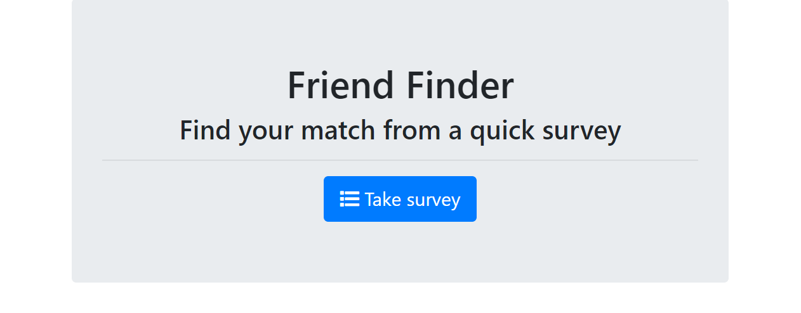

# bamazon
Friend Finder matches you with a someone who has similar answers to the survey as you. 

## Getting Started

The first screenshot displays the home page. Click "Take survey" to continue.

The second screenshot promts users to enter his/her name, image URL and answer 10 questions that reflect his/her personality.

### Installing

* NPM init -y

* NPM install path

* NPM install express

* NPM install body-parser

## Built With

* [Javascript](https://www.javascript.com/) - JavaScript

* [Node.js](https://nodejs.org/en/) - Node.js

* [Node Package Manager](https://www.npmjs.com/) - Package manager for JavaScript and Node

## Authors

* **Hannah Lim** - [hannahlim213](https://github.com/hannahlim213)

## License

This project is licensed under the MIT License - see the [LICENSE.md](LICENSE.md) file for details